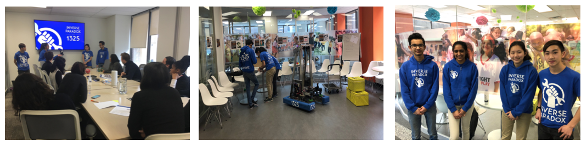
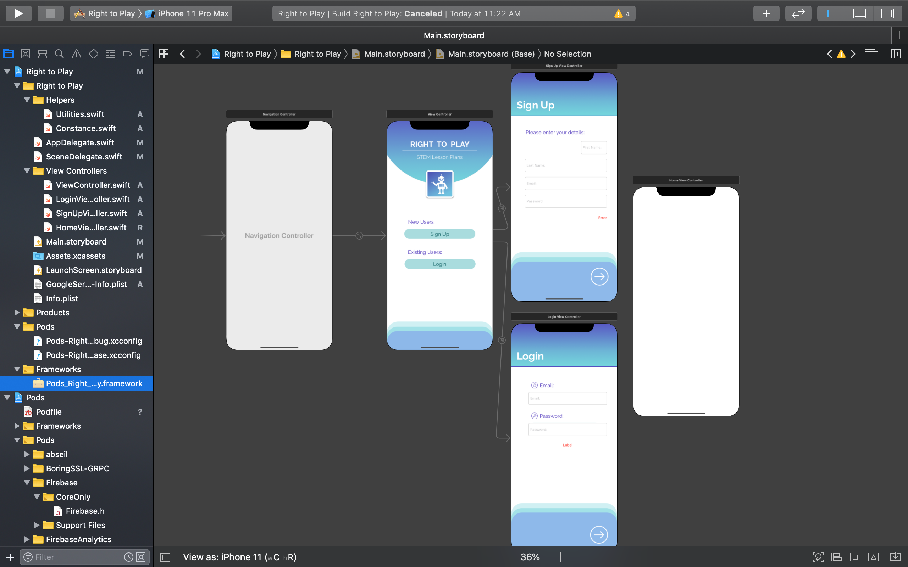
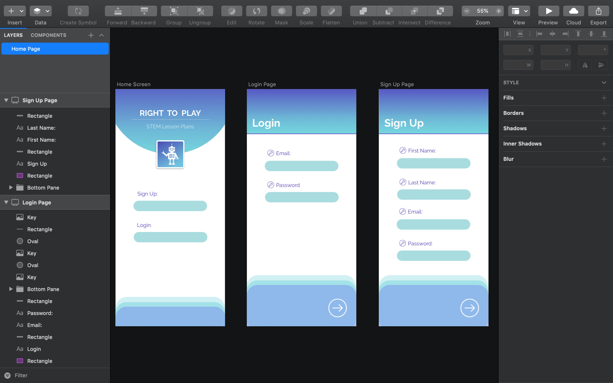

# Right to Play
Educational mobile app for teachers in Ontario

### Description of Project
This mobile app is made for a non-profit organization Right to Play, who focuses on increasing STEM based and hands on learning in schools. The goal of this project is to make a resource that is accessible to educators and RTP program staff that allows them to easily run lesson plans and workshops independently without technical experience or knowledge. The lesson plans have been created in the subjects of Mechanical Design, Electrical and Programming.  

#### Visit to Office

#### Prototyping
The design was created in Sketch and then programmed in Xcode. 

